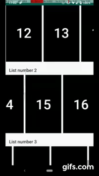
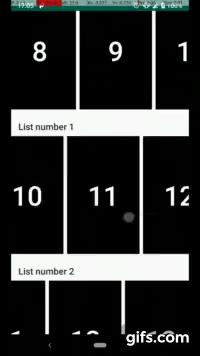
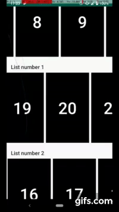
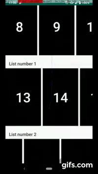

# RecyclerView Nested Example

Read my blog posts:

1. https://rubensousa.com/2019/08/16/nested_recyclerview_part1/

2. https://rubensousa.com/2019/08/27/saving_scroll_state_of_nested_recyclerviews/

## Left - RecyclerView / Right - OrientationAwareRecyclerView

</img>  </img>

</img>  </img> 

